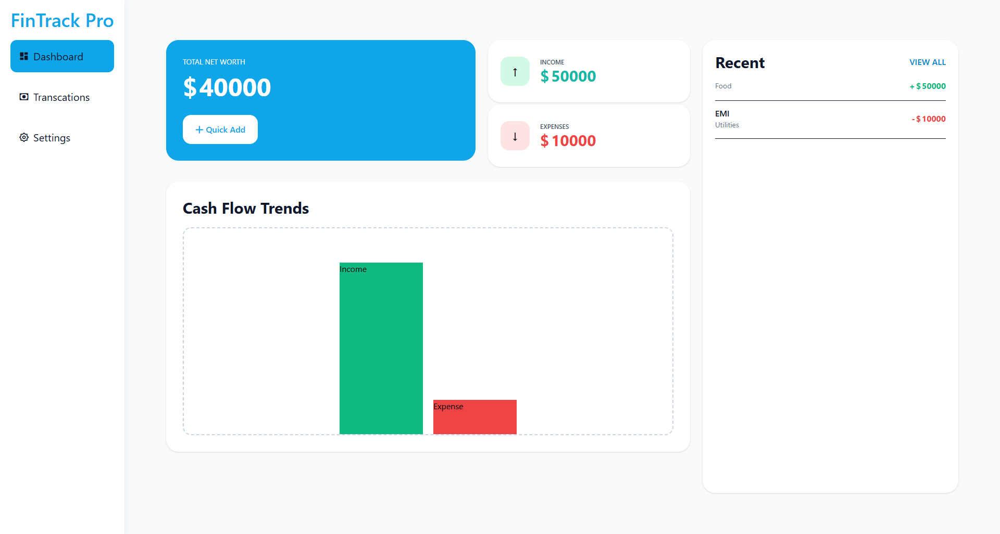
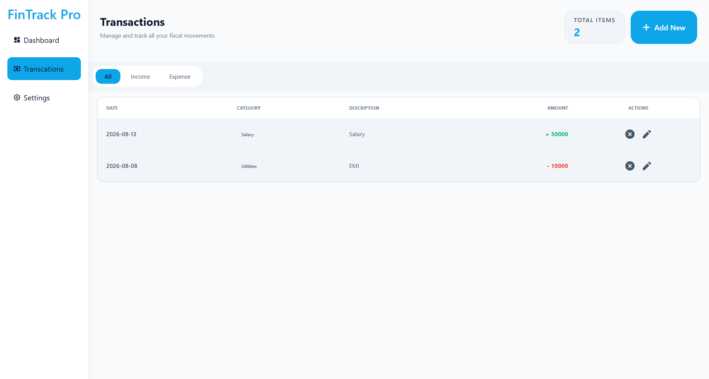
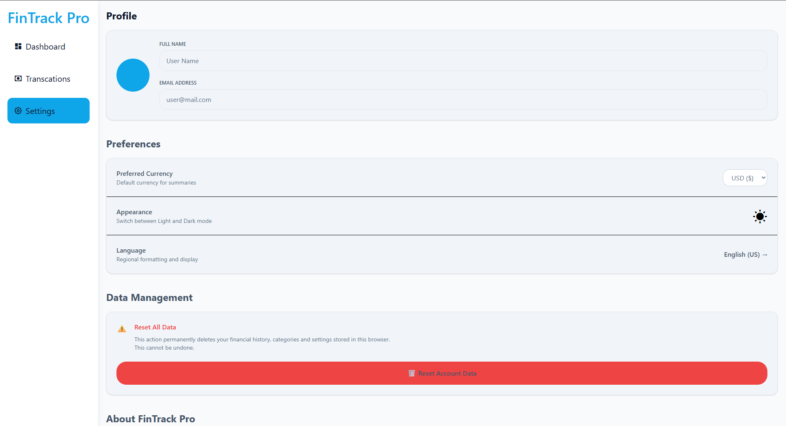

<div align="center">

# 💰 FinTrack Pro

### A multi-page personal finance dashboard — built to learn how real frontend applications are architected, not just styled.

**HTML · CSS · Tailwind CSS · Vanilla JavaScript (ES Modules) · localStorage**

[](#)
[](#)
[](#)
[](#)
[](#-license)

**[▶ Live Demo](https://fintrack-dashboard-project.vercel.app/)** &nbsp;·&nbsp; **[🐛 Report Bug](https://www.linkedin.com/in/rajshah-dev/)** &nbsp;·&nbsp; **[💡 Request Feature](https://www.linkedin.com/in/rajshah-dev/)**

</div>

<br>

<div align="center">

  

</div>

---

## 🎯 What Is FinTrack Pro?

FinTrack Pro started as a question, not a feature list:

> *"Can I stop writing pages, and start architecting an application?"*

It's a fully client-side personal finance tracker — dashboard, transactions, and settings — with income/expense analytics, net-worth calculation, theming, and persistent data. But the real project wasn't the UI. It was rebuilding my own JavaScript from **one giant script** into a **modular, decoupled, React-ready architecture** — entirely in Vanilla JS.

---

## ✨ Features

- 📊 **Dashboard** — live income, expense & net-worth summary with graph visualization
- 💳 **Transactions** — full CRUD (add, edit, delete) with a reusable modal
- ⚙️ **Settings** — currency selection, dark/light theme, persisted preferences
- 💾 **Persistent state** via `localStorage` — survives refreshes, no backend needed
- 📱 **Fully responsive** — sliding mobile nav, adaptive tables, mobile-first breakpoints
- 🧩 **Modular ES architecture** — pages, components, and core logic cleanly separated

---

## 🛠️ Tech Stack

| Layer | Tools |
|---|---|
| **Markup** | Semantic HTML5 |
| **Styling** | Tailwind CSS (v4, utility-first) |
| **Logic** | Vanilla JavaScript, ES Modules |
| **State** | In-memory data layer + `localStorage` persistence |
| **Pattern** | Callback-based cross-module communication |

---

## 🏗️ Architecture

The single biggest shift in this project: moving from **one script** to **responsibility-bound modules.**

```
                        main.js  (entry point / orchestrator)
                            │
            ┌───────────────┼───────────────┐
            ▼               ▼               ▼
        Dashboard      Transactions      Settings
            │               │               │
            └───────────────┼───────────────┘
                            ▼
                       Components
                    (modal, navbar…)
                            ▼
                    core/storage.js
                            ▼
                       localStorage
```

**The rule that made it work:** higher-level modules can depend on lower-level ones — never the reverse. That one principle eliminated every circular dependency in the codebase.

```
FinTrack/
├── .vscode/
│
├── js/
│   ├── components/
│   │   ├── charts.js
│   │   ├── navbar.js
│   │   ├── transactionForm.js
│   │   └── transactionTable.js
│   │
│   ├── core/
│   │   └── storage.js
│   │
│   ├── pages/
│   │   ├── dashboard.js
│   │   ├── settings.js
│   │   └── transaction.js
│   │
│   └── main.js
│
├── node_modules/
│
├── screenshot/
│   ├── homePage.png
│   ├── homePhone.png
│   ├── settingsDesktop.png
│   ├── settingsPhone.png
│   ├── transactionDesktop.png
│   └── transactionPhone.png
│
├── styles/
│   ├── components.css
│   ├── input.css
│   ├── output.css
│   └── variables.css
│
├── .gitignore
├── index.html
├── navbar.html
├── package-lock.json
├── package.json
├── README.md
├── script.js
├── settings.html
└── transactions.html
```

---

## 🔁 How Data Flows

```
User Action → Event → State Update → saveTrans() → localStorage → Re-render UI
```

Every number on screen — income, expenses, net worth — is **derived**, not stored. One source of truth (`allTrans`), everything else is calculated from it on demand.

---

## 🧠 Engineering Decisions Worth Highlighting

| Challenge | What I Learned | The Fix |
|---|---|---|
| Dashboard & Transactions both needed a form | Reusable components > duplicated markup | One shared modal, driven by state |
| Modules calling each other directly caused **circular dependencies** | A module shouldn't know *who* is using it | Replaced direct calls with **callbacks** — `transModalSubmit(() => { ... })` |
| Re-opening the edit modal fired actions multiple times | Event *registration* ≠ event *execution* | Attach listeners once at init; mutate state separately |
| ES module functions aren't globally accessible to inline `onclick` | Module scope vs. global `window` scope | Deliberately bridged via `window.fn = fn` where needed |
| "No console errors" ≠ "it's working" | Debugging needs a systematic trace, not guesswork | Built a 9-step trace: script → module → DOM → event → state → storage → render |

---

## 🤖 How I Used AI — As a Mentor, Not a Generator

The workflow was never *"build me a dashboard."* It was:

```
Build → Hit a wall → Investigate → Ask a targeted "why" question
   → Understand the concept → Implement it myself → Test → Repeat
```

This shift — from *"give me the code"* to *"why is this happening?"* — is what turned the project into real architectural understanding instead of a pile of borrowed snippets.

---

## 📈 Skill Progression

<table>
<tr>
<td valign="top" width="25%">

**Tailwind CSS**
- Utility-first composition
- Responsive breakpoints
- v4 setup (`@import "tailwindcss"`)
- Hover/focus/transitions

</td>
<td valign="top" width="25%">

**Responsive Design**
- Mobile-first thinking
- Sliding sidebar nav
- Adaptive tables
- Shared DOM, adaptive layout

</td>
<td valign="top" width="25%">

**JavaScript Architecture**
- ES Modules (`export`/`import`)
- Dependency direction
- Circular dependency resolution
- Callback-driven communication

</td>
<td valign="top" width="25%">

**Application Thinking**
- CRUD design
- State → persistence → render
- Derived data
- Systematic debugging

</td>
</tr>
</table>

---

## 🚀 The Bridge to React

This project wasn't built in isolation — it was built as a **deliberate on-ramp to React.**

| Built in FinTrack Pro | Prepares Me For |
|---|---|
| Reusable transaction modal | Components |
| `allTrans` array | State |
| `localStorage` persistence | Persistence layer |
| Dynamic DOM rendering | JSX rendering |
| Callback-based updates | Props & callback functions |
| Page-level modules | Component/page architecture |
| State → UI updates | React's rendering model |
| Derived calculations | Derived state |

```
HTML → CSS → Tailwind → Vanilla JS → DOM → Events
   → localStorage → CRUD → ES Modules → Components
   → Callbacks → State Management → REACT
```

---

## 🗺️ Roadmap

- [ ] Migrate to React + component-based state
- [ ] Replace inline `onclick` with delegated event handling
- [ ] Add data export (CSV/JSON)
- [ ] Add category-based budgeting & alerts
- [ ] Chart library upgrade for richer visualizations
- [ ] Multi-currency live conversion
- [ ] Unit tests for core storage logic

---

## 👨‍💻 Author

<div align="center">

### **Raj Shah**
*Frontend developer moving from Vanilla JS architecture into React.*

[](https://github.com/rajshahdev966)
[](https://www.linkedin.com/in/rajshah-dev/)

</div>

---

## 📄 License

Distributed under the **MIT License**.

---

<div align="center">

**⭐ If this project's architecture story was useful, a star helps a lot.**

*Keywords: Vanilla JavaScript finance dashboard, ES Modules architecture, Tailwind CSS multi-page app, localStorage CRUD app, frontend state management without React, responsive finance tracker, JavaScript circular dependency fix, callback-based module communication*

</div>